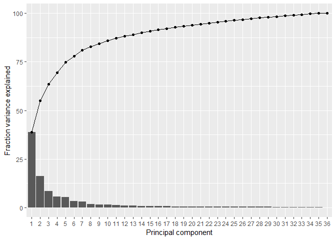
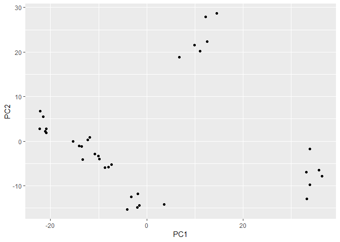

Principle Component Analysis(PCA)
================
Lan Lin
2022-07-19

Having expression data for thousands of genes can be overwhelming to
explore! This is a good example of a multi-dimensional dataset: we have
many variables (genes) that we want to use to understand patterns of
similarity between our samples (yeast cells).

There are several methods to help summarise multi-dimensional data, here
we will show how to use PCA (principal component analysis).

PCA is a transformation of high-dimensional data into an orthogonal
basis such that first principal component (PC, aka “axis”) is aligned
with the largest source of variance, the second PC to the largest
remaining source of variance and so on. This makes high-dimensional data
more amenable to visual exploration, as we can examine projections to
the first two (or few) PCs.

``` r
# Read in the world map
trans_cts <- read_csv("./data/counts_transformed.csv")
```

    ## Rows: 6011 Columns: 37
    ## ── Column specification ────────────────────────────────────────────────────────
    ## Delimiter: ","
    ## chr  (1): gene
    ## dbl (36): wt_0_r1, wt_0_r2, wt_0_r3, wt_15_r1, wt_15_r2, wt_15_r3, wt_30_r1,...
    ## 
    ## ℹ Use `spec()` to retrieve the full column specification for this data.
    ## ℹ Specify the column types or set `show_col_types = FALSE` to quiet this message.

To compute a PCA in R we can use the prcomp() function. This function
takes a matrix of data, where the columns are the variables that we want
to use to transform our samples, which should be the rows of the matrix.

In our case, we want to look for similarities across our yeast cells
(samples = rows) based on gene expression (variables = columns). For
that reason, we need to provide a transposed version of our table to the
prcomp() function:

``` r
# Create a matrix from our table of counts
pca_matrix <- trans_cts %>% 
  # make the "gene" column become the rownames of the table
  column_to_rownames("gene") %>% 
  # coerce to a matrix
  as.matrix() %>% 
  # transpose the matrix so that rows = samples and columns = variables
  t()

# Perform the PCA
sample_pca <- prcomp(pca_matrix)
sample_pca
```

    ## Standard deviations (1, .., p=36):
    ##  [1] 1.872708e+01 1.213484e+01 8.758419e+00 7.154657e+00 6.986644e+00
    ##  [6] 5.427376e+00 5.196966e+00 4.097936e+00 3.787942e+00 3.670933e+00
    ## [11] 3.306630e+00 3.019401e+00 2.913792e+00 2.731942e+00 2.690219e+00
    ## [16] 2.601458e+00 2.448744e+00 2.359425e+00 2.311000e+00 2.224820e+00
    ## [21] 2.181147e+00 2.165395e+00 2.128354e+00 2.045020e+00 2.034889e+00
    ## [26] 1.975104e+00 1.945004e+00 1.925746e+00 1.883931e+00 1.832501e+00
    ## [31] 1.812695e+00 1.754024e+00 1.696509e+00 1.659840e+00 1.596530e+00
    ## [36] 3.537713e-14
    ## 
    ## Rotation (n x k) = (6011 x 36):
    ##                           PC1           PC2           PC3           PC4
    ## SPAC212.11       6.526373e-03  2.167482e-02 -1.464637e-02  2.038742e-02
    ## SPAC212.09c      9.150639e-03 -1.339169e-02 -9.839950e-03  2.243901e-02
    ## SPAC212.04c      1.254270e-02 -1.526486e-02  1.091129e-03 -2.174451e-02
    ## SPNCRNA.601     -4.605518e-03  5.708931e-03  7.897095e-03 -2.292634e-02
    ## SPAC977.11      -1.755760e-03 -5.809152e-03 -1.391510e-02 -2.416043e-02
    ## SPAC977.13c      3.420996e-02 -2.266345e-02 -1.378088e-03 -1.515223e-02
    ## SPAC977.15       1.259865e-02  2.228144e-02 -2.492114e-03  8.718142e-03
    ## SPAC977.16c      1.021273e-02  1.822550e-02 -7.516240e-03  1.839307e-02
    ## SPNCRNA.607      2.212316e-02 -3.566242e-02  1.463160e-02 -1.930820e-02
    ## SPAC1F8.06      -1.590720e-02 -2.703912e-02 -1.676294e-02  8.822928e-04
    ## SPAC1F8.08      -9.324139e-03  9.456583e-03  1.276801e-03 -1.056775e-02
    ## SPAC11D3.19      1.000328e-03 -2.614752e-03 -1.545189e-02 -3.483437e-02
    ## SPAC11D3.01c     9.969503e-03 -3.684654e-02  2.496838e-02  1.544728e-02
    ## SPNCRNA.608     -1.328620e-03 -6.078621e-03  4.320063e-03 -4.538619e-02
    ## SPAC11D3.02c    -7.285713e-03  2.569790e-02 -1.261367e-03 -1.795812e-02
    ## SPAC11D3.03c     6.598114e-03 -5.461656e-03  5.687495e-03  2.596286e-02
    ## SPAC11D3.05      4.344211e-02  2.226233e-02 -6.298315e-03 -7.923446e-03
    ## SPAC11D3.07c     1.090168e-02 -2.488577e-02 -1.544203e-02 -9.568307e-03
    ## SPAC11D3.08c     1.732779e-02 -1.796654e-02 -3.523394e-02 -4.455321e-02
    ## SPAC11D3.11c     4.742466e-03 -8.965703e-03 -4.945535e-03  2.043766e-03
    ## SPAC11D3.14c    -4.138575e-03  3.784560e-03 -1.043967e-02  9.338541e-04
    ## SPNCRNA.609      3.104901e-03 -2.687694e-02 -8.902788e-03  2.111864e-03
    ## SPAC11D3.16c     1.728472e-02 -1.372047e-02 -1.614413e-02 -3.071996e-02
    ## SPAC11D3.18c    -3.814553e-04 -1.773520e-02  3.983267e-04 -2.754703e-02
    ## SPNCRNA.612     -1.053856e-03 -1.331700e-02 -7.955611e-03  9.383675e-03
    ## SPAC5H10.01      1.238304e-03  6.013128e-03 -1.159853e-02  1.259492e-02
    ## SPAC5H10.03      1.191736e-02  2.297253e-02  6.258627e-04 -9.730719e-03
    ##                           PC5           PC6           PC7           PC8
    ## SPAC212.11       2.431597e-03 -8.497804e-03  5.457321e-03 -7.224234e-03
    ## SPAC212.09c     -9.936374e-03  1.415475e-02 -2.192896e-03  4.338186e-04
    ## SPAC212.04c      3.025104e-03 -4.544775e-03 -2.638953e-02  1.891383e-02
    ## SPNCRNA.601      6.043470e-03  2.039260e-02 -3.519256e-03  1.149674e-02
    ## SPAC977.11       2.516711e-03 -3.457407e-03  2.231375e-02 -9.613485e-03
    ## SPAC977.13c      1.117871e-02 -6.089932e-03 -2.453371e-03  2.424385e-03
    ## SPAC977.15       3.880659e-02 -1.657968e-02  4.097057e-03 -1.820097e-02
    ## SPAC977.16c      6.358888e-02 -8.366005e-03 -2.202273e-02 -1.606188e-02
    ## SPNCRNA.607      1.036031e-02  8.738810e-03 -4.804158e-03 -1.006342e-02
    ## SPAC1F8.06      -2.494709e-02 -2.881724e-02 -2.364946e-02 -8.968376e-04
    ## SPAC1F8.08       7.127686e-03 -1.416138e-02 -1.837433e-03  3.136778e-03
    ## SPAC11D3.19      1.000103e-02  1.639657e-02  5.103070e-04 -2.293878e-02
    ## SPAC11D3.01c    -2.050653e-02  3.103537e-02  1.920357e-02  3.472764e-02
    ## SPNCRNA.608      9.594822e-03  3.183795e-02 -1.640169e-02 -9.849729e-03
    ## SPAC11D3.02c     3.022214e-02 -1.694426e-02 -1.592998e-02  3.196182e-04
    ## SPAC11D3.03c     5.689405e-03 -3.133004e-02  6.454219e-03  7.947109e-03
    ## SPAC11D3.05      5.613881e-03 -1.659743e-02 -8.087918e-03  1.028715e-02
    ## SPAC11D3.07c     7.010082e-03  5.888012e-04  1.736892e-02 -9.202868e-03
    ## SPAC11D3.08c     2.837542e-02 -1.009400e-02  5.597924e-04 -1.443345e-02
    ## SPAC11D3.11c     8.888787e-03  6.933417e-03 -4.279543e-03 -2.620464e-02
    ## SPAC11D3.14c     1.762635e-02 -6.657721e-03  1.026397e-02 -1.522053e-02
    ## SPNCRNA.609      1.356538e-03 -1.266502e-02 -3.941258e-02 -1.265202e-02
    ## SPAC11D3.16c     1.334338e-03 -2.507803e-02 -5.984577e-03  1.378615e-02
    ## SPAC11D3.18c     5.714900e-03  2.007552e-02 -1.625813e-02  1.042547e-02
    ## SPNCRNA.612     -3.346501e-03 -4.214457e-02 -1.358697e-02 -4.515369e-03
    ## SPAC5H10.01      1.398296e-03  1.089003e-02 -6.413883e-03  1.151877e-02
    ## SPAC5H10.03      3.898058e-02 -4.667031e-03 -2.176384e-02 -1.556293e-02
    ##                           PC9          PC10          PC11          PC12
    ## SPAC212.11       3.018437e-03  1.599268e-03  5.408455e-03 -5.184076e-03
    ## SPAC212.09c      1.905731e-02 -6.588587e-03  9.551469e-03  3.109947e-03
    ## SPAC212.04c     -4.233812e-02  5.501071e-02 -4.188285e-02  2.442483e-02
    ## SPNCRNA.601      2.170572e-02  7.560018e-03  5.608575e-03 -1.202623e-02
    ## SPAC977.11      -2.408249e-02  1.406040e-02  1.305178e-02 -2.501274e-03
    ## SPAC977.13c      2.416219e-02 -2.058613e-02 -1.279591e-04  2.535429e-02
    ## SPAC977.15      -2.843221e-03  1.302080e-02  2.054281e-02 -1.371447e-02
    ## SPAC977.16c      1.149510e-02 -1.249078e-02  2.476420e-02 -3.570430e-02
    ## SPNCRNA.607      1.808308e-02  1.582549e-02 -1.262690e-03  9.082590e-03
    ## SPAC1F8.06      -2.734061e-02 -1.099826e-02 -3.445983e-02  1.955691e-02
    ## SPAC1F8.08      -6.818446e-03  3.573225e-03 -1.602562e-02  2.168508e-02
    ## SPAC11D3.19     -1.165169e-02  8.200614e-03  9.666932e-03 -3.764675e-02
    ## SPAC11D3.01c     3.800055e-02 -9.865525e-03  5.975746e-02 -9.865509e-03
    ## SPNCRNA.608      1.855010e-02  1.348570e-02  2.272677e-02 -2.134636e-02
    ## SPAC11D3.02c    -1.060659e-02  1.093019e-02 -2.615781e-02  1.219257e-02
    ## SPAC11D3.03c    -3.720587e-03 -9.075920e-03  2.606758e-03  1.470980e-02
    ## SPAC11D3.05     -6.214816e-03  4.534753e-03  2.247805e-02  1.308022e-02
    ## SPAC11D3.07c    -5.770585e-03  7.149208e-03 -1.239643e-02  1.328745e-02
    ## SPAC11D3.08c    -1.409784e-03  5.932945e-04  3.798370e-03 -2.843057e-03
    ## SPAC11D3.11c     5.122015e-03  1.103808e-02  1.104594e-02 -1.586361e-03
    ## SPAC11D3.14c     8.694494e-03 -1.952662e-03  4.629551e-03 -1.539067e-02
    ## SPNCRNA.609      1.020038e-02  1.132909e-03 -6.729610e-03  1.328787e-02
    ## SPAC11D3.16c    -4.721796e-03 -1.178672e-02 -9.341559e-03 -3.952796e-03
    ## SPAC11D3.18c    -1.703098e-02  7.802791e-03  3.772485e-03 -1.077677e-02
    ## SPNCRNA.612      2.455053e-02 -1.388711e-02  2.453431e-03  5.450027e-03
    ## SPAC5H10.01      3.789586e-04  7.229139e-03  2.136334e-03 -2.811949e-03
    ## SPAC5H10.03     -1.068826e-02 -1.291404e-02 -4.155740e-04 -9.399413e-03
    ##                          PC13          PC14          PC15          PC16
    ## SPAC212.11      -1.799547e-02 -1.738359e-02 -7.407221e-03  3.947673e-02
    ## SPAC212.09c     -3.652561e-03 -2.592909e-02 -7.984198e-03 -1.856243e-03
    ## SPAC212.04c      4.676315e-02  6.381512e-03 -9.891640e-03 -2.622519e-02
    ## SPNCRNA.601     -6.867384e-03 -1.474595e-03 -9.331663e-03  1.985188e-03
    ## SPAC977.11      -1.089606e-02 -1.582430e-02 -7.871352e-03  1.302216e-02
    ## SPAC977.13c     -2.070985e-02 -7.760268e-04  1.035077e-02  3.399719e-02
    ## SPAC977.15       6.958873e-03  7.704456e-04  3.016618e-02 -6.161155e-03
    ## SPAC977.16c      1.396120e-02 -1.098969e-03  3.375079e-02  4.069163e-02
    ## SPNCRNA.607      2.138719e-02 -6.609168e-04 -1.004028e-02  2.294132e-03
    ## SPAC1F8.06       1.235725e-02  3.248370e-02 -4.456673e-03 -1.995108e-02
    ## SPAC1F8.08      -6.631281e-03 -1.636029e-02 -9.010687e-03  1.974142e-02
    ## SPAC11D3.19     -9.281922e-03 -2.715035e-02  4.988626e-02 -3.207639e-02
    ## SPAC11D3.01c     6.229142e-02  3.064364e-03 -9.596037e-03  2.527693e-02
    ## SPNCRNA.608     -5.808417e-03 -4.671217e-03 -1.044532e-02  5.849659e-03
    ## SPAC11D3.02c     1.072494e-02  5.638546e-03  4.727743e-03 -1.665265e-02
    ## SPAC11D3.03c     3.129423e-02  1.779654e-02  6.734233e-03  2.696632e-03
    ## SPAC11D3.05      1.326408e-02  5.979933e-03  8.956072e-03 -7.704050e-03
    ## SPAC11D3.07c     2.180868e-03 -1.327153e-02  5.905914e-03 -1.710208e-03
    ## SPAC11D3.08c     1.497093e-02 -1.320668e-02  3.697506e-03  1.010762e-02
    ## SPAC11D3.11c     1.805548e-02 -4.437209e-04  2.567435e-02 -1.927411e-02
    ## SPAC11D3.14c     1.361455e-02 -1.289402e-03  9.578422e-03  8.023457e-03
    ## SPNCRNA.609      6.439173e-03  1.973323e-02 -4.925262e-03 -9.329706e-03
    ## SPAC11D3.16c    -1.360222e-02 -4.232766e-03  7.936456e-03 -1.019316e-02
    ## SPAC11D3.18c    -2.737827e-03  3.226411e-02  1.374476e-02  1.446235e-02
    ## SPNCRNA.612     -1.061778e-02 -9.972120e-03  5.223986e-03 -1.492790e-02
    ## SPAC5H10.01      2.201439e-02 -2.630373e-03  2.431569e-02 -3.100993e-02
    ## SPAC5H10.03      1.230761e-02  3.399036e-03 -3.323184e-03 -4.276243e-03
    ##                          PC17          PC18          PC19          PC20
    ## SPAC212.11      -1.059962e-02  2.187824e-02  3.155668e-02  5.886777e-03
    ## SPAC212.09c     -2.590356e-02  2.129615e-03  9.553093e-03  3.639652e-03
    ## SPAC212.04c     -4.426330e-02  6.671275e-03 -5.823764e-03 -4.264386e-03
    ## SPNCRNA.601     -2.406287e-02  1.217677e-03 -1.125706e-02  3.040260e-03
    ## SPAC977.11      -1.814311e-02  2.183525e-02 -2.010765e-02  3.036717e-02
    ## SPAC977.13c      3.197262e-02  1.847843e-02  2.854317e-02  1.055868e-02
    ## SPAC977.15       3.350517e-03  5.939546e-03  2.816312e-02  7.919388e-03
    ## SPAC977.16c      1.172834e-02  2.047051e-02  2.378853e-02  2.854466e-02
    ## SPNCRNA.607     -3.235839e-02  1.652142e-02  4.964766e-04 -5.369408e-04
    ## SPAC1F8.06      -2.625311e-02  8.851435e-03 -1.342497e-02 -2.616134e-03
    ## SPAC1F8.08       2.897814e-02  1.364724e-02 -5.500744e-03 -1.950600e-02
    ## SPAC11D3.19      2.293404e-02  5.640867e-02  4.875746e-03  1.425345e-02
    ## SPAC11D3.01c     1.458568e-02 -2.120536e-02 -2.270899e-02 -8.594648e-03
    ## SPNCRNA.608     -2.276377e-03 -7.196231e-03 -1.462726e-02 -7.583042e-03
    ## SPAC11D3.02c    -4.382182e-03  8.729186e-03 -3.512186e-03 -1.493845e-02
    ## SPAC11D3.03c     1.543677e-02 -6.655325e-03 -2.296728e-02  1.779486e-02
    ## SPAC11D3.05     -2.199551e-02 -1.430908e-02 -1.590609e-02 -1.495704e-02
    ## SPAC11D3.07c     9.346184e-03  3.842066e-03  8.204233e-04 -7.113799e-03
    ## SPAC11D3.08c     5.001044e-03  2.206238e-02  7.547779e-03  4.084026e-03
    ## SPAC11D3.11c    -1.424733e-02  2.570344e-02 -6.736993e-03 -4.740522e-03
    ## SPAC11D3.14c     3.729979e-03 -1.678797e-02 -7.050018e-03  9.343554e-03
    ## SPNCRNA.609      3.877162e-03 -3.045348e-03 -1.916668e-02 -1.473768e-03
    ## SPAC11D3.16c     1.811042e-02 -1.660475e-03  3.526127e-03 -1.504262e-02
    ## SPAC11D3.18c    -1.554040e-02 -3.507712e-02  2.698348e-02  1.159163e-02
    ## SPNCRNA.612     -4.778495e-02  4.191918e-02 -2.373023e-02 -2.079900e-02
    ## SPAC5H10.01     -1.859410e-02 -4.295074e-03 -6.039959e-03  3.065624e-02
    ## SPAC5H10.03      3.699763e-03  5.756690e-03  4.324772e-03  2.604316e-03
    ##                          PC21          PC22          PC23          PC24
    ## SPAC212.11       3.551789e-02 -2.685136e-04  1.232454e-02 -4.317472e-02
    ## SPAC212.09c     -2.320099e-03 -1.415262e-03  2.893894e-05  2.896896e-02
    ## SPAC212.04c      3.590004e-03  2.601343e-02  2.060605e-04  5.449320e-03
    ## SPNCRNA.601      2.587584e-02 -5.648876e-02  7.314124e-03 -1.929206e-02
    ## SPAC977.11       4.564394e-03 -1.956297e-03  3.955371e-03  4.206961e-03
    ## SPAC977.13c     -3.216747e-03 -2.506595e-02  5.538703e-03  1.065946e-02
    ## SPAC977.15       2.357317e-02  6.218448e-03 -3.165044e-02 -3.910254e-02
    ## SPAC977.16c      2.348007e-02  1.814346e-02  2.438928e-02  5.005105e-03
    ## SPNCRNA.607     -5.799091e-05  1.032752e-02 -1.323305e-02  1.302974e-03
    ## SPAC1F8.06       1.330279e-02 -7.591156e-03  9.766975e-03 -2.373076e-05
    ## SPAC1F8.08       7.377687e-03  1.270419e-02  2.061266e-02  2.417651e-03
    ## SPAC11D3.19      9.859604e-03  2.638063e-02 -9.647871e-03  9.601165e-03
    ## SPAC11D3.01c     2.144749e-02 -8.593633e-02  3.735242e-02 -1.628638e-02
    ## SPNCRNA.608      3.732277e-02  3.679911e-03  4.524552e-03 -2.935118e-02
    ## SPAC11D3.02c    -4.190798e-03  3.741778e-03 -2.394744e-02  2.756946e-02
    ## SPAC11D3.03c     2.373882e-03 -2.175777e-02 -2.562122e-02  3.000658e-02
    ## SPAC11D3.05      5.860549e-03 -1.570910e-02 -4.087688e-03  2.195801e-02
    ## SPAC11D3.07c     6.773565e-05 -1.139018e-02  4.642787e-03 -2.566704e-03
    ## SPAC11D3.08c     1.522591e-03 -4.112701e-03  8.911751e-03 -2.615259e-03
    ## SPAC11D3.11c     2.233962e-02 -2.398806e-02 -8.059056e-03  1.941874e-02
    ## SPAC11D3.14c     1.222644e-02 -3.383507e-02  1.462101e-02 -2.472713e-02
    ## SPNCRNA.609      4.280707e-03  1.702965e-02  2.188715e-03 -4.656739e-03
    ## SPAC11D3.16c     1.465336e-02  9.844273e-03 -2.092913e-03  1.630187e-02
    ## SPAC11D3.18c     4.656080e-03 -2.115354e-02 -1.388239e-02  1.053292e-02
    ## SPNCRNA.612      4.617961e-05 -8.215754e-03 -3.976011e-02 -2.043571e-02
    ## SPAC5H10.01      2.637976e-02  7.058493e-04  1.230433e-02 -2.014542e-02
    ## SPAC5H10.03      3.596463e-03 -3.173710e-03 -1.105303e-03  3.509653e-03
    ##                          PC25          PC26          PC27          PC28
    ## SPAC212.11       1.686337e-02 -2.116289e-02 -2.863227e-02  5.169902e-03
    ## SPAC212.09c      9.424176e-03 -2.661334e-02 -5.616670e-03 -3.051832e-03
    ## SPAC212.04c     -2.338614e-04 -1.495188e-02  2.538960e-02 -1.738368e-02
    ## SPNCRNA.601     -2.563340e-02  1.083231e-02 -1.960771e-02 -3.401547e-02
    ## SPAC977.11      -1.170800e-02 -1.243741e-02 -6.738599e-04  5.781416e-03
    ## SPAC977.13c     -7.712866e-03 -2.466958e-02  7.543533e-03 -8.977338e-03
    ## SPAC977.15       1.027765e-02  2.586245e-02 -2.298758e-02  6.457322e-03
    ## SPAC977.16c      1.702452e-02 -1.168544e-03  2.058800e-02 -3.737972e-02
    ## SPNCRNA.607      1.098011e-02  6.378865e-03 -3.176021e-02 -3.389846e-02
    ## SPAC1F8.06      -2.810207e-03 -9.771983e-04 -3.151549e-02 -2.598027e-02
    ## SPAC1F8.08       4.959237e-03 -5.931493e-03  3.672933e-03 -3.083862e-03
    ## SPAC11D3.19      4.347802e-02  6.437037e-03  3.970952e-02 -2.935048e-02
    ## SPAC11D3.01c    -9.525338e-03 -6.207000e-02  3.218884e-02  1.028973e-02
    ## SPNCRNA.608     -1.522297e-02  5.602233e-04 -1.324530e-02  1.438608e-02
    ## SPAC11D3.02c     1.059604e-02 -2.791187e-03  1.940247e-02  1.005252e-02
    ## SPAC11D3.03c    -1.186635e-03 -7.421649e-03  1.967538e-02  1.843966e-02
    ## SPAC11D3.05     -4.331010e-03  5.912523e-03  6.532937e-03  2.939216e-03
    ## SPAC11D3.07c    -2.372923e-04 -5.350549e-03 -2.847859e-02 -5.950972e-03
    ## SPAC11D3.08c    -4.649796e-03  2.449111e-03  1.626712e-02  1.844770e-02
    ## SPAC11D3.11c    -2.991213e-02  1.532371e-03  1.164789e-02  1.625639e-02
    ## SPAC11D3.14c     4.882563e-03  6.505866e-03  1.199002e-02 -1.125529e-02
    ## SPNCRNA.609      2.282297e-02 -2.781265e-02 -9.958616e-03  5.132386e-03
    ## SPAC11D3.16c    -1.062853e-02  2.404706e-02 -6.759316e-03 -7.687036e-03
    ## SPAC11D3.18c     1.080370e-02  7.751533e-03  1.685142e-02 -1.792079e-03
    ## SPNCRNA.612      1.347194e-02  2.352439e-03 -1.895179e-02  3.659332e-02
    ## SPAC5H10.01      9.080233e-03  6.300116e-03 -2.782631e-03 -6.756632e-03
    ## SPAC5H10.03      2.901049e-03  8.798381e-03 -2.637254e-03  7.506009e-03
    ##                          PC29          PC30          PC31          PC32
    ## SPAC212.11      -2.830496e-02  5.401876e-02  3.309134e-02 -2.831335e-02
    ## SPAC212.09c      7.288761e-03 -3.612160e-02  9.728296e-04 -3.266826e-02
    ## SPAC212.04c      2.220107e-02 -9.317128e-03  3.273021e-03  2.652019e-02
    ## SPNCRNA.601      2.959472e-02 -1.547423e-02  1.582666e-02  1.843751e-02
    ## SPAC977.11       4.748286e-03  1.011728e-02  2.047928e-02 -3.541976e-02
    ## SPAC977.13c     -1.548113e-02 -4.369866e-03  5.119695e-03  1.927362e-02
    ## SPAC977.15      -1.104767e-02  9.850480e-03 -1.752816e-02  1.507953e-02
    ## SPAC977.16c     -2.025399e-02  3.226139e-02 -1.056740e-02  6.755976e-03
    ## SPNCRNA.607     -1.495400e-03 -1.838766e-02 -6.743080e-03  1.358185e-02
    ## SPAC1F8.06       1.286489e-02  9.813770e-03 -1.490131e-02 -1.562475e-02
    ## SPAC1F8.08      -3.697709e-03 -1.637576e-02  1.469879e-02 -1.502015e-02
    ## SPAC11D3.19     -1.196905e-06 -3.924798e-02 -2.130804e-04  1.246004e-03
    ## SPAC11D3.01c    -2.761675e-02 -1.390182e-02 -3.754376e-02 -7.206608e-02
    ## SPNCRNA.608      4.270886e-04  6.878015e-03 -1.459181e-02 -5.437998e-03
    ## SPAC11D3.02c    -1.517273e-02  2.067393e-03  7.629130e-03 -1.993941e-02
    ## SPAC11D3.03c     1.727078e-02  1.185519e-02  5.811069e-03 -1.047653e-02
    ## SPAC11D3.05     -1.991471e-02  8.654554e-03  1.699852e-02  3.129535e-02
    ## SPAC11D3.07c    -7.954596e-03 -1.251059e-03  7.345988e-03  6.132097e-03
    ## SPAC11D3.08c     1.476676e-02 -1.827892e-02  1.087168e-02 -2.981672e-02
    ## SPAC11D3.11c     1.029357e-03  2.013841e-02  9.522906e-03 -4.501210e-04
    ## SPAC11D3.14c    -1.450107e-02  1.222836e-02  4.560656e-03  9.583016e-03
    ## SPNCRNA.609     -1.140529e-02 -3.883027e-02  1.074973e-02  8.214427e-04
    ## SPAC11D3.16c    -6.627999e-04 -1.765212e-02  1.025113e-02 -5.799361e-03
    ## SPAC11D3.18c    -2.760635e-02 -3.743490e-03  3.746544e-03  1.360921e-02
    ## SPNCRNA.612     -6.536999e-03 -4.255272e-03  1.228860e-02 -6.480494e-03
    ## SPAC5H10.01     -1.025398e-02  3.394653e-02 -1.460260e-02 -1.454086e-02
    ## SPAC5H10.03      6.762575e-03 -4.310904e-03  1.624127e-03 -2.145701e-03
    ##                          PC33          PC34          PC35          PC36
    ## SPAC212.11       8.809755e-03  2.708359e-02  5.286557e-03 -1.791935e-01
    ## SPAC212.09c     -1.523377e-02  2.071431e-02 -1.074515e-02 -8.972817e-02
    ## SPAC212.04c      3.041818e-02 -3.005342e-03  7.115618e-03  3.182624e-02
    ## SPNCRNA.601     -6.288711e-03  1.336450e-02 -2.364192e-02 -4.469083e-02
    ## SPAC977.11      -3.320071e-02  1.469234e-03  1.046229e-03  1.656311e-01
    ## SPAC977.13c      7.432875e-03 -2.894095e-03 -2.517090e-03  5.456661e-02
    ## SPAC977.15      -2.982978e-03  1.560482e-02 -9.010822e-03  3.619842e-03
    ## SPAC977.16c     -7.256171e-03  2.243661e-02  1.600986e-02  2.427226e-02
    ## SPNCRNA.607     -1.700460e-02 -9.364969e-03 -4.505051e-03 -8.203305e-02
    ## SPAC1F8.06       1.085180e-03  1.557195e-02 -7.426385e-03  2.093392e-02
    ## SPAC1F8.08       2.000875e-02  1.377387e-02  8.447892e-03 -6.652922e-02
    ## SPAC11D3.19      1.121006e-02 -4.553413e-03  1.089295e-02  3.466309e-02
    ## SPAC11D3.01c     2.763516e-02 -7.202645e-03 -9.262483e-02 -9.085564e-04
    ## SPNCRNA.608     -8.159033e-03 -1.104492e-02 -1.328857e-03 -1.464082e-02
    ## SPAC11D3.02c     1.530464e-02 -1.261779e-02  2.838848e-02  5.535652e-02
    ## SPAC11D3.03c     1.815182e-02 -1.696513e-02  1.156242e-02 -3.559493e-03
    ## SPAC11D3.05     -3.276183e-03 -3.606908e-03 -6.121405e-03 -3.439462e-02
    ## SPAC11D3.07c    -6.252805e-03 -7.639031e-03  7.744659e-03  2.385144e-02
    ## SPAC11D3.08c     8.346587e-03  7.065858e-03  1.035669e-02 -3.915156e-02
    ## SPAC11D3.11c    -1.377204e-02  1.411949e-02 -1.468491e-03 -2.429588e-02
    ## SPAC11D3.14c    -6.842144e-03 -6.199459e-03  1.841542e-02 -1.993050e-03
    ## SPNCRNA.609     -3.152744e-03 -1.830515e-02 -1.130339e-02 -1.378972e-02
    ## SPAC11D3.16c    -1.212369e-02 -1.408233e-02 -1.265051e-02 -5.445401e-02
    ## SPAC11D3.18c     1.005043e-02  8.859637e-03 -3.855638e-02  6.283270e-03
    ## SPNCRNA.612     -7.733558e-03 -4.135039e-03  6.950165e-03  8.301239e-02
    ## SPAC5H10.01      2.867747e-02 -8.146753e-03  4.168561e-03 -2.230425e-02
    ## SPAC5H10.03     -6.898273e-03 -1.924191e-03  3.051020e-04 -2.843163e-02
    ##  [ reached getOption("max.print") -- omitted 5984 rows ]

The first important question to ask after we do a PCA is how many PCs we
have and how much variance they explain.

We need to extract the variance explained by each PC from our sample_pca
object. prcomp() returns an oject of its own class. To access individual
elements from this object, we use the $ notation, similarly to how you
can access individual columns from a data.frame.

``` r
#biplot(sample_pca, xlabs = rep(".", nrow(trans_cts)), cex = 1.2)
pc_eigenvalues <- sample_pca$sdev^2
# create a "tibble" manually with 
# a variable indicating the PC number
# and a variable with the variances
pc_eigenvalues <- tibble(PC = factor(1:length(pc_eigenvalues)), 
                         variance = pc_eigenvalues) %>% 
  # add a new column with the percent variance
  mutate(pct = variance/sum(variance)*100) %>% 
  # add another column with the cumulative variance explained
  mutate(pct_cum = cumsum(pct))

# print the result
pc_eigenvalues
```

    ## # A tibble: 36 × 4
    ##    PC    variance   pct pct_cum
    ##    <fct>    <dbl> <dbl>   <dbl>
    ##  1 1        351.  38.8     38.8
    ##  2 2        147.  16.3     55.2
    ##  3 3         76.7  8.50    63.7
    ##  4 4         51.2  5.67    69.3
    ##  5 5         48.8  5.41    74.7
    ##  6 6         29.5  3.26    78.0
    ##  7 7         27.0  2.99    81.0
    ##  8 8         16.8  1.86    82.8
    ##  9 9         14.3  1.59    84.4
    ## 10 10        13.5  1.49    85.9
    ## # … with 26 more rows

Notice that we’ve encoded the PC variable as a factor because this is
really a categorical variable (the identifier of the principal
component).

This table can now be used to produce a Scree Plot, which shows the
fraction of total variance explained by each principal component. We
will show both the variance explained by individual PCs as well as the
cumulative variance, using a type of visualisation known as a pareto
chart:

``` r
pc_eigenvalues %>% 
  ggplot(aes(x = PC)) +
  geom_col(aes(y = pct)) +
  geom_line(aes(y = pct_cum, group = 1)) + 
  geom_point(aes(y = pct_cum)) +
  labs(x = "Principal component", y = "Fraction variance explained")
```

<!-- -->

Next, we turn to visualising our samples on the new PC coordinate

``` r
# The PC scores are stored in the "x" value of the prcomp object
pc_scores <- sample_pca$x
pc_scores <- pc_scores %>% 
  # convert to a tibble retaining the sample names as a new column
  as_tibble(rownames = "sample")

# print the result
pc_scores
```

    ## # A tibble: 36 × 37
    ##    sample      PC1    PC2     PC3     PC4    PC5     PC6    PC7    PC8    PC9
    ##    <chr>     <dbl>  <dbl>   <dbl>   <dbl>  <dbl>   <dbl>  <dbl>  <dbl>  <dbl>
    ##  1 wt_0_r1  -21.5    5.53   0.130  -8.28  10.2    -4.45   2.93  -0.121  0.299
    ##  2 wt_0_r2  -20.9    2.80 -13.3    -0.106  7.52    0.392 -0.137 -5.90   0.900
    ##  3 wt_0_r3  -20.8    1.83 -13.5     0.402  8.98    0.263  0.170 -3.55   1.13 
    ##  4 wt_15_r1  12.2   27.9   11.1    -2.04   5.00   20.0   14.2   -3.50  -7.37 
    ##  5 wt_15_r2  11.0   20.2    5.92   -1.18  -3.16    0.975 -6.95  -2.88   5.86 
    ##  6 wt_15_r3  14.5   28.7   -4.50   26.1   -2.23  -16.8   10.5    0.393 -1.86 
    ##  7 wt_30_r1  33.1   -6.93   2.18  -10.4    3.76   -4.28   8.81   4.05   5.50 
    ##  8 wt_30_r2  35.7   -6.54 -14.8     0.719 -0.640   4.31   0.349 -3.51   2.83 
    ##  9 wt_30_r3  33.2  -13.0  -16.9     1.83   2.43    3.47   1.76  -2.14   5.72 
    ## 10 wt_60_r1  -1.87 -11.9   10.3     9.11   2.64    4.40   1.37  -2.82   5.68 
    ## # … with 26 more rows, and 27 more variables: PC10 <dbl>, PC11 <dbl>,
    ## #   PC12 <dbl>, PC13 <dbl>, PC14 <dbl>, PC15 <dbl>, PC16 <dbl>, PC17 <dbl>,
    ## #   PC18 <dbl>, PC19 <dbl>, PC20 <dbl>, PC21 <dbl>, PC22 <dbl>, PC23 <dbl>,
    ## #   PC24 <dbl>, PC25 <dbl>, PC26 <dbl>, PC27 <dbl>, PC28 <dbl>, PC29 <dbl>,
    ## #   PC30 <dbl>, PC31 <dbl>, PC32 <dbl>, PC33 <dbl>, PC34 <dbl>, PC35 <dbl>,
    ## #   PC36 <dbl>

``` r
pc_scores %>% 
  # create the plot
  ggplot(aes(x = PC1, y = PC2)) +
 geom_point()
```

<!-- -->

This is a very simple plot, but already we can see there is some
structure in our data, suggesting clusters of samples that are more
similar to each other.
