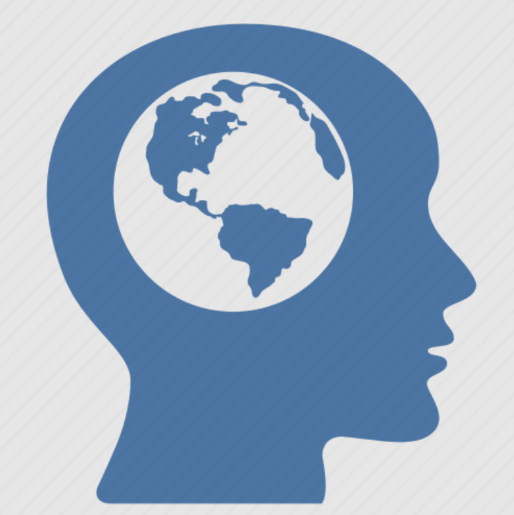

The world is made of data and driven by data. I believe we know the world and ourself better when we dig further into the data.
Let's have fun!  
* Find a good data resource   
* Build the math model   
* Learn programming  
    + R
    + Python
    + Java 

